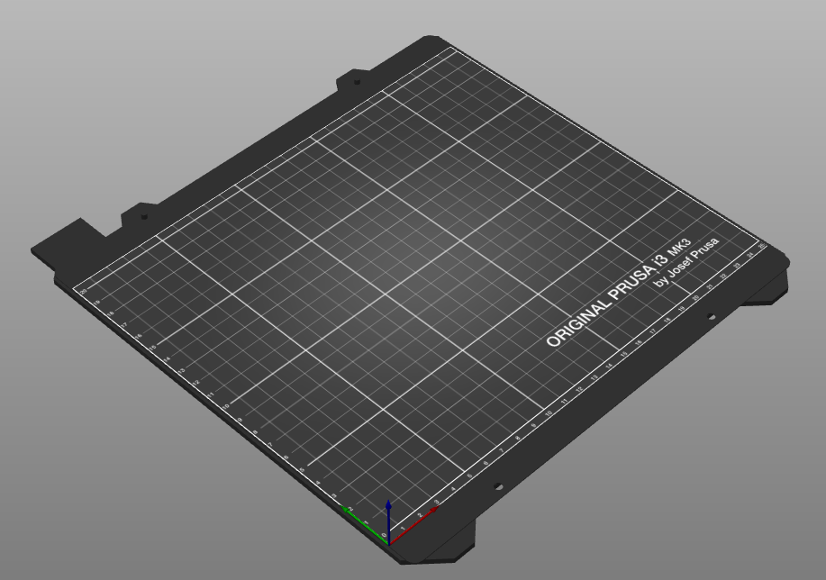

# bed_texture

* Technologie : FDM / SLA
* Groupe : [Réglages de l'Imprimante](../printer_settings/printer_settings.md)
* Sous groupe : Forme du plateau
* Mode : -

## Texture du plateau

### Description

Fichier SVG permettant de dessiner une texture du plateau.

Exemple de texture sur modèle machine Prusa i3 MK3

[Retour Liste variables](variable_list.md)