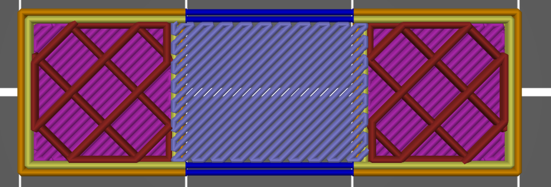

# bridge_angle

* Technologie : FDM
* Groupe : [Réglages de l'Impression](../print_settings/print_settings.md)
* Sous groupe : [Remplissage](../print_settings/print_settings.md#remplissage) - Avancé
* Mode : Avancé

##  Angle du Pont

### Description

Permet d'imposer l'angle du remplissage pour les ponts. Si laissé à zéro, l'angle des ponts sera calculé automatiquement. Sinon, l'angle fourni sera utilisé pour tous les ponts. 

Exemple d'un angle de pont fixé à 45°

> Utilisez 180° pour un angle nul.

[Retour Liste variables](variable_list.md)