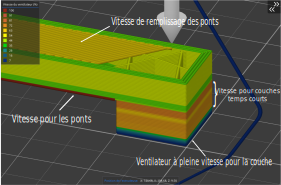

# bridge_internal_fan_speed

* Technologie : FDM
* Groupe : [Réglages du Filament](../filament_settings/filament_settings.md)
* Sous groupe : [Refroidissement](../filament_settings/filament_settings.md#refroidissement) - Vitesse du ventilateur par défaut
* Mode : Avancé
* Version 2.3.57.5

## Remplissage des ponts

### Description

Cette vitesse de ventilation est appliquée pendant tous les ponts de remplissage. 
Cela ne ralentira pas le le ventilateur s'il fonctionne déjà à une vitesse plus élevée. 

Mettre 1 pour utiliser la vitesse par défaut.
Mettre -1 pour désactiver ce réglage (Les ponts de remplissage auront le ventilateur allant à la même vitesse que pour les ponts).

Ne peut être remplacée que par [disable_fan_first_layers](disable_fan_first_layers.md).

[Retour Liste variables](variable_list.md)