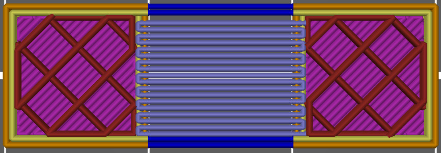
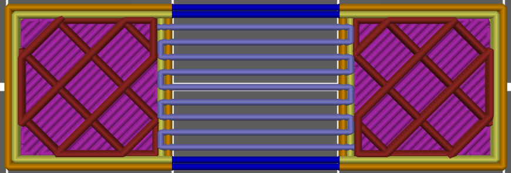

# bridge_overlap

* Technologie : FDM
* Groupe : [Réglages de l'Impression](../print_settings/print_settings.md)
* Sous groupe : [Largeur et Débit](../print_settings/print_settings.md#largeur-et-débit) - [Chevauchement](../print_settings/print_settings.md#chevauchement)
* Mode : Expert

## Recouvrement des ponts

### Description

Quantité de chevauchement entre les lignes du pont. Si vous voulez plus d'espace entre les lignes (ou moins), vous pouvez le modifier. La valeur par défaut est de 100%. Une valeur de 50% créer deux fois moins de lignes.

Recouvrement d'un pont fixé à 100%

Recouvrement d'un pont fixé à 50%

[Retour Liste variables](variable_list.md)