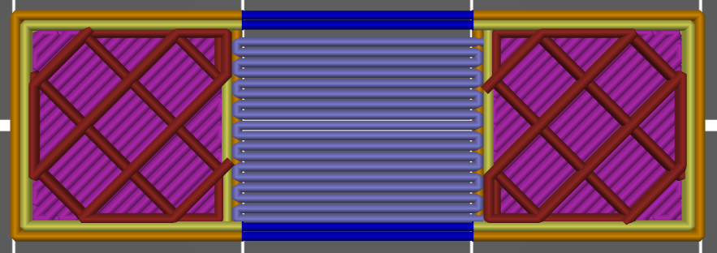
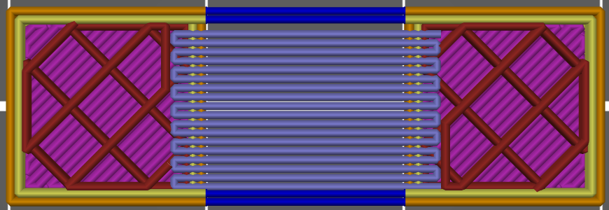

# bridged_infill_margin

* Technologie : FDM
* Groupe : [Réglages de l'Impression](../print_settings/print_settings.md)
* Sous groupe : [Remplissage](../print_settings/print_settings.md#remplissage) - Avancé
* Mode : Expert

## *Ancrage des remplissages pleins* Ponts

### Description

Ce paramètre agrandi les couches en pont par la valeur renseignée pour les ancrer dans la pièce.

> Mettez 0 pour le désactiver. 

> Peut être un % de [ la largeur du périmètre externe](external_perimeter_extrusion_width.md).

Ancrage des remplissage du pont fixé à 100% = Une largeur de périmètre externe.

Ancrage des remplissage du pont fixé à 400%

* Valeur par défaut : 200%

[Retour Liste variables](variable_list.md)