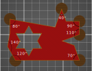

# brim_ears

* Technologie : FDM
* Groupe : [Réglages de l'Impression](../print_settings/print_settings.md)
* Sous groupe : [Bordure et Jupe](../print_settings/print_settings.md#bordure-et-jupe) - Jupe sur les coins
* Mode : Simple

## Jupe sur les coins

### Description

Option qui permet de ne mettre une jupe qu'autour des arrêtes saillantes externes du modèle. Le réglage de la jupe peut se faire en spécifiant L'[Angle maximal](brim_ears_max_angle.md)  et une [Longueur de détection](brim_ears_detection_length.md).   

Pour ce type de jupe il est possible de spécifier un [Motif](brim_ears_pattern.md) spécifique.

Avec un réglage par défaut à 125° on voit sur l'image ci dessus que les angles saillants de plus de 120° n'ont pas de jupe.

[Retour Liste variables](variable_list.md)