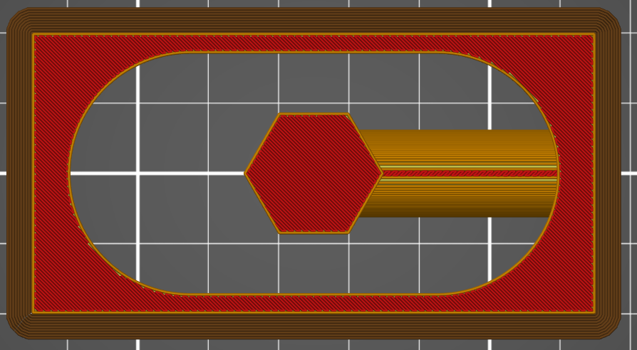
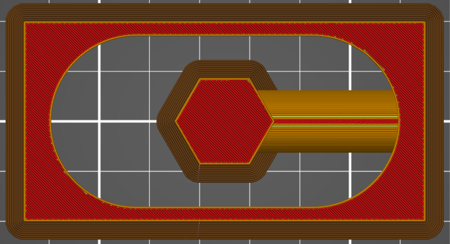

# brim_inside_holes

* Technologie : FDM
* Groupe : [Réglages de l'Impression](../print_settings/print_settings.md)
* Sous groupe : Jupe & Bordure - Bordure
* Mode : Avancé

## Bordure à l’intérieur des trous

### Description

Permet de créer une bordure sur un îlot lorsqu'il est à l'intérieur d'un trou (ou entourée par un objet).

Exemple de pièce pouvant avoir une bordure à l'intérieur d'un trou

Avec l'option brim_inside_holes activée.

[Retour Liste variables](variable_list.md)