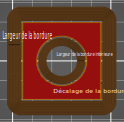

# brim_offset

* Technologie : FDM
* Groupe : [Réglages de l'Impression](../print_settings/print_settings.md)
* Sous groupe : [Bordure et Jupe](../print_settings/print_settings.md#bordure-et-jupe) - Jupe
* Mode : Expert

## Décalage de la jupe

### Description

Distance entre la jupe et la pièce. Normalement la valeur doit être maintenue à 0, sauf si vous rencontrez de grandes difficultés pour séparer la jupe du modèle. 

La distance est soustraite à [brim_width](brim_width.md) et [brim_width_interior](brim_width_interior.md), elle doit donc être inférieure à celles-ci.

L'objectif de cette distance est de faciliter le retrait du bord du modèle. En plaçant les lignes du bord légèrement à l'écart du modèle réel (de l'ordre d'une demi-ligne), la connexion entre le bord et le modèle devient plus faible qu'une couche, ce qui permet d'enlever les jupes plus facilement. Cela permet également de réduire la cicatrice ou la patte d'éléphant laissée par le bord après son enlèvement. Cette méthode est particulièrement efficace lorsque la [hauteur de la couche initiale](initial_layer_height.md) est plus grande, car une jupe épaisse a tendance à être plus difficile à enlever. En revanche, cela réduit également l'efficacité de la jupe pour maintenir le modèle collé au plateau d'impression. 

[Retour Liste variables](variable_list.md)