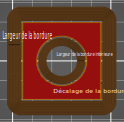

# brim_width

* Technologie : FDM
* Groupe : [Réglages de l'Impression](../print_settings/print_settings.md)
* Sous groupe : [Bordure et Jupe](../print_settings/print_settings.md#bordure-et-jupe) - Jupe
* Mode : Simple

## Largeur de la jupe

### Description

Largeur de la jupe qui sera imprimée autour de chaque objet sur la première couche.

Une jupe plus large améliorera l'adhérence au plateau, en augmentant la surface de votre impression.

[Retour Liste variables](variable_list.md)