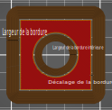

# brim_width_interior

* Technologie : FDM
* Groupe : [Réglages de l'Impression](../print_settings/print_settings.md)
* Sous groupe : Jupe & Bordure - Bordure
* Mode : Avancé

## Largeur de la bordure intérieure

### Description

Largeur de la bordure intérieure, qui sera imprimée à l'intérieur des trous d'un objet sur la première couche.

La bordure intérieur n'ajoute généralement que très peu de force d'adhérence supplémentaire entre l'impression et la plaque de montage et n'a aucun effet sur la prévention du rétrécissement. en fixant une largeur de bordure intérieure à Zéro cela peut vous faire gagner du temps à l'impression et une fois l'impression terminée, car vous n'aurez pas besoin de retirer la bordure sur les trous intérieurs.

[Retour Liste variables](variable_list.md)