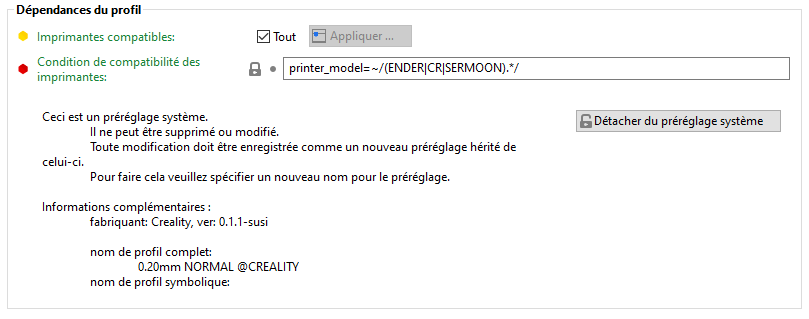

# compatible_prints

* Technologie : FDM
* Groupe : [Réglages du Filament](../filament_settings/filament_settings.md)
* Sous groupe : -
* Mode : Avancé

## Profils d'impression compatibles

### Description

Sélection des profils d'impression compatibles avec  lesquels  les réglages sont compatibles.

La sélection de la case Tout permet de tout sélectionner.

[Retour Liste variables](variable_list.md)
