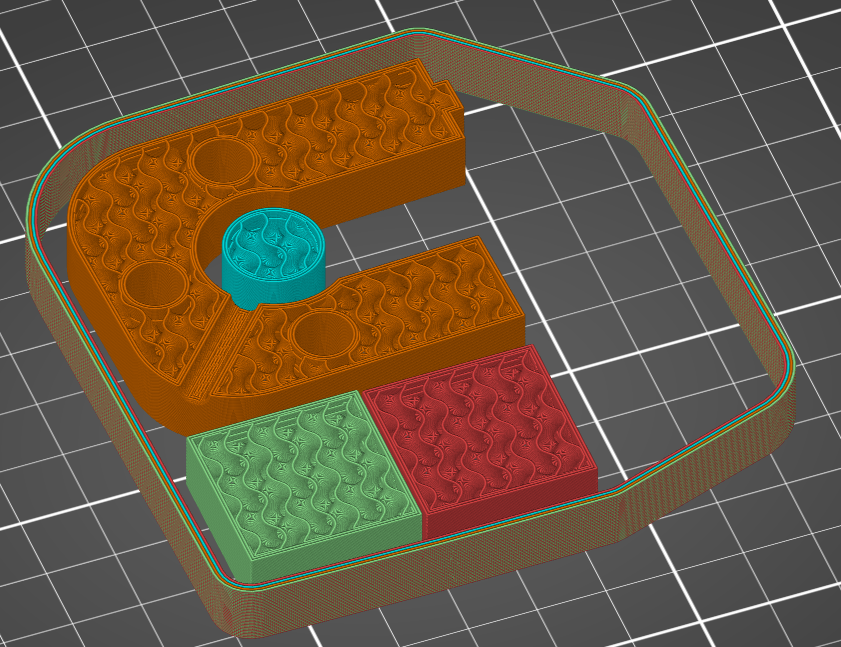

# draft_shield

* Technologie : FDM
* Groupe : [Réglages de l'Impression](../print_settings/print_settings.md)
* Sous groupe : [Bordure et Jupe](../print_settings/print_settings.md#bordure-et-jupe) 
* Mode : Avancé 

## Bouclier contre les flux d'air

### Description

Si elle est activée, la bordure sera aussi haute que l'objet imprimé le plus haut. Cela sert à protéger les impressions ABS ou ASA des phénomènes de déformation ou de décollement du plateau d'impression liés au flux d'air.

Le bouclier a plusieurs effets majeurs sur l'impression :
* Il maintient la température de l'impression plus constante. C'est l'effet recherché du bouclier. Par conséquent, les défaut dues aux variations de température dans la pièce devraient être réduites.
* En général, la température à l'intérieur du bouclier est plus élevée. En effet, la chaleur a plus de mal à s'échapper et il ne peut y avoir de courants de convection qui s'élèvent avec l'air chaud de l'impression. Cela a un effet sur tous les aspects de l'impression. En particulier, il y aura plus de filasse et d'affaissement.
* Les ventilateurs de la tête d'impression seront moins efficaces. Le bouclier perturbe également la circulation de l'air à cet endroit. Pour augmenter l'efficacité des ventilateurs sur la tête d'impression, la [distance](skirt_distance.md) du bouclier peut être augmentée.
* Le nombre de périmètre du bouclier est définie comme pour la bordure par le [nombre de boucle](skirts.md) . 
* Le bouclier peut servir de [Tour de purge](wipe_tower.md). Comme il est imprimé avant l'objet, l'impression du bouclier est un moyen de purger le matériau avant d'entamer l'impression de la nouvelle couche. Il est a noter que vous devrez avoir autant de périmètres que vous avez d'extrudeuse en fonction pour etre certains que chaque extrudeuse pourra être purgé sur la bouclier. Dans ce cas de figure le bouclier ne sera pas imprimé complètement avant la pièce mais chaque périmètre sera imprimé au moment de purger une nouvelle extrudeuse. 

[Retour Liste variables](variable_list.md)