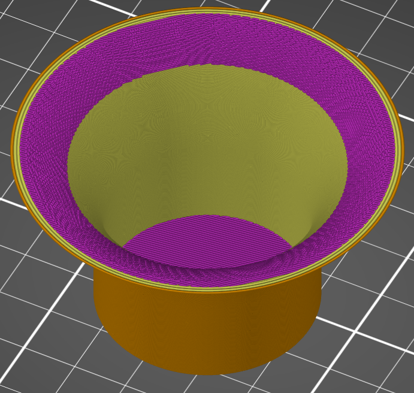

# ensure_vertical_shell_thickness

* Technologie : FDM
* Groupe : [Réglages de l'Impression](../print_settings/print_settings.md)
* Sous groupe : [Périmètre et enveloppe](../print_settings/print_settings.md#périmètre-et-enveloppe) - [Qualité](../print_settings/print_settings.md#qualité)
* Mode : Avancé

## S'assurer de l'épaisseur de la coque verticale

### Description

Ajouter un remplissage plein à proximité des surfaces inclinées pour garantir une épaisseur de coque verticale ([Epaisseur de couches minimale du dessus](top_solid_min_thickness.md) + [du dessous](bottom_solid_min_thickness.md)).

[Retour Liste variables](variable_list.md)