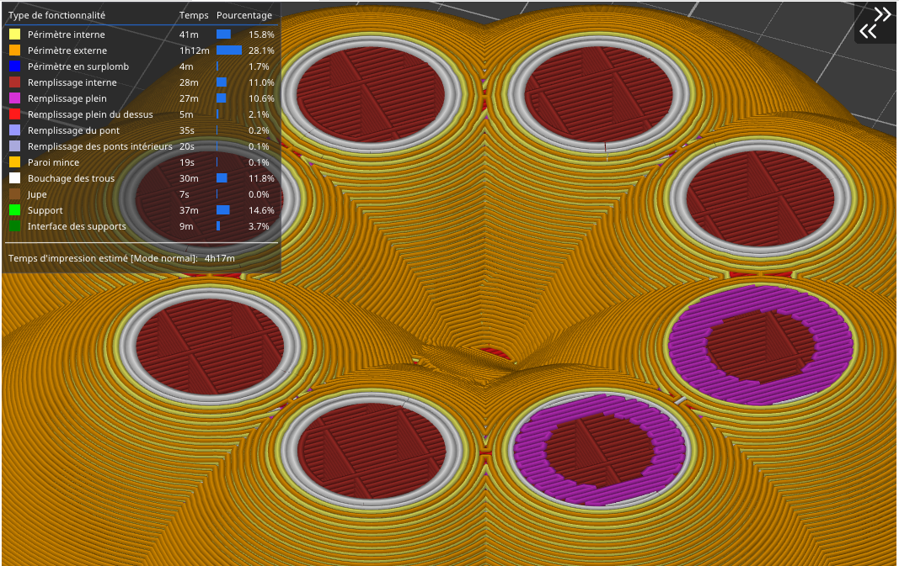
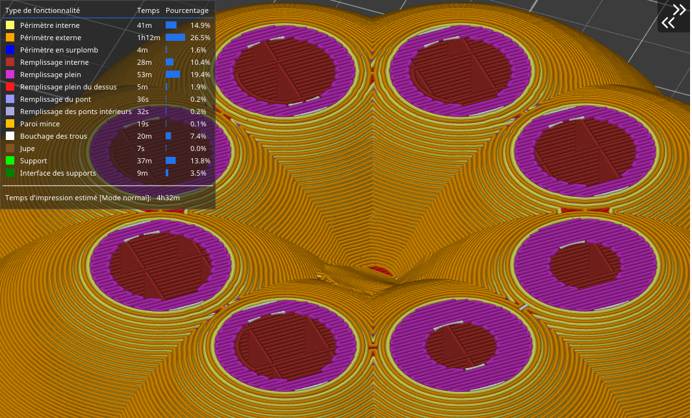

# ensure_vertical_shell_thickness

* Technologie : FDM
* Groupe : [Réglages de l'Impression](../print_settings/print_settings.md)
* Sous groupe : [Périmètre et enveloppe](../print_settings/print_settings.md#périmètre-et-enveloppe) - [Qualité](../print_settings/print_settings.md#qualité)
* Mode : Avancé

## S'assurer de l'épaisseur de la coque verticale

### Description

Ajouter un remplissage plein à proximité des surfaces inclinées pour garantir une épaisseur de coque verticale ([Epaisseur de couches minimale du dessus](top_solid_min_thickness.md) + [du dessous](bottom_solid_min_thickness.md)).

Cette fonction résout l'un des plus gros problèmes des slicers plus anciens, à savoir le fait d'avoir des trous entre les périmètres sur une surface avec un faible galbe. Cela était typique lors de l'impression de figurines et d'autres modèles organiques. De tels objets avaient généralement quelques trous sur le dessus des modèles. Lorsque cette fonction est activée, SuperSlicer s'assure que les remplissages internes seront suffisant pour garantir le support des couches supérieures.

Exemple de découpe sans que l'option soit active :

Une fois l'option activé on peut constater que le nombre de remplissage plein sera augmenté dans les zones supérieures..

Cette fonctionnalité affecte  encore actuellement la génération du G-Code même lorsqu'elle est désactivée et peut produire un G-code inattendu. Il s'agit d'un problème connu et nous travaillons sur un correctif.

[Retour Liste variables](variable_list.md)