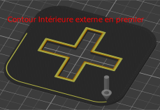

# external_perimeters_hole

* Technologie : FDM
* Groupe : [Réglages de l'Impression](../print_settings/print_settings.md)
* Sous groupe : [Périmètre et enveloppe](../print_settings/print_settings.md#périmètre-et-enveloppe) - Périmètre extérieur en premier
* Mode : Expert

## *Appliquer sur* Le côté intérieur

### Description

Ne faites le périmètre extérieur en premier que sur le côté intérieur.
Utile quand vous voulez seulement retirer la couture des trous de vis.

Vous devez avoir activé l'option [external_perimeters_first](external_perimeters_first.md) pour accéder à ce paramètre.

[Retour Liste variables](variable_list.md)