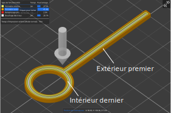

# external_perimeters_nothole

* Technologie : FDM
* Groupe : [Réglages de l'Impression](../print_settings/print_settings.md)
* Sous groupe : [Périmètre et enveloppe](../print_settings/print_settings.md#périmètre-et-enveloppe) - Périmètre extérieur en premier 
* Mode : Expert

##  Appliquer sur le côté extérieur

### Description

Ne faites le périmètre extérieur en premier que sur le côté extérieur.
Utile quand l'épaisseur est trop faible.

Vous devez avoir activé l'option [external_perimeters_first](external_perimeters_first.md) pour accéder à ce paramètre.

[Retour Liste variables](variable_list.md)
