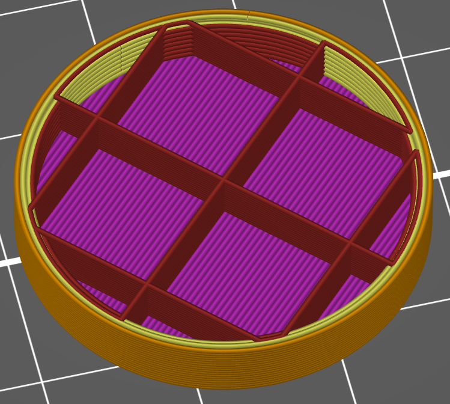

# extra_perimeters_odd_layers

* Technologie : FDM
* Groupe : [Réglages de l'Impression](../print_settings/print_settings.md)
* Sous groupe : [Périmètre et enveloppe](../print_settings/print_settings.md#périmètre-et-enveloppe) - Qualité
* Mode : Avancé

## Périmètres supplémentaires sur les couches impaires

### Description

Ajouter un périmètre à chaque couche impaire. Avec cela, le remplissage est pris en sandwich et vous pourrez peut-être réduire considérablement  le paramètre de chevauchement remplissage / périmètre.

Sur l'image ci-dessous on peut voir que un périmètre sur 2 l'ancrage du remplissage est pris entre deux cordons.

Attention ! si le remplissage est à Zéro en densité avec cette option d'activé un périmètre supplémentaire sera rajouté sur chaque couche. 

[Retour Liste variables](variable_list.md)