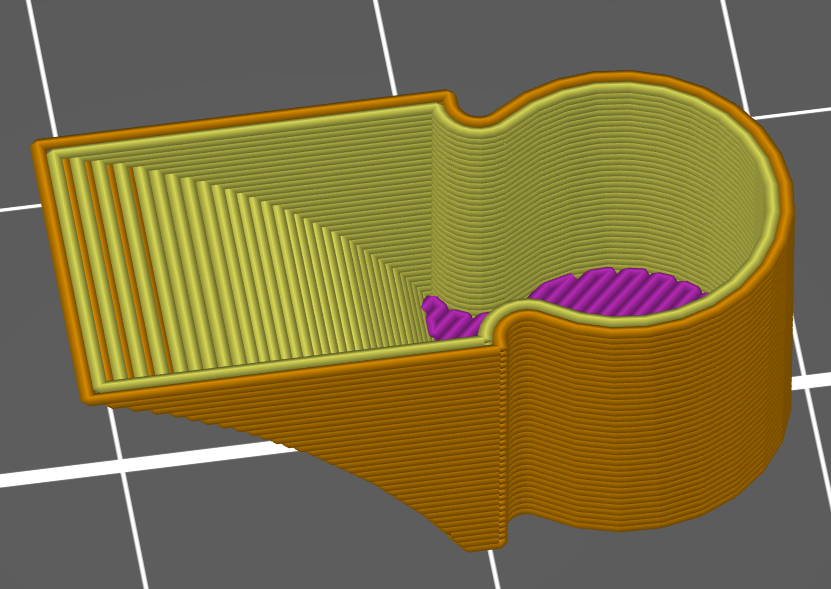
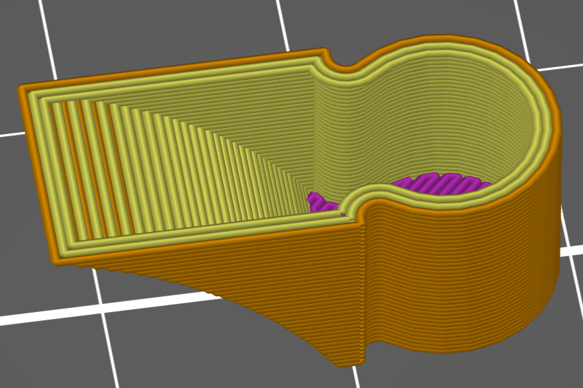
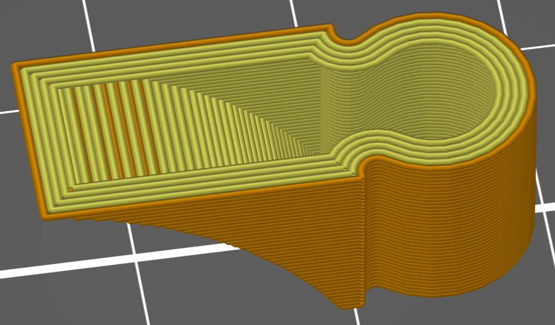

# extra_perimeters_overhangs

* Technologie : FDM
* Groupe : [Réglages de l'Impression](../print_settings/print_settings.md)
* Sous groupe : [Périmètre et enveloppe](../print_settings/print_settings.md#périmètre-et-enveloppe) - [Qualité](../print_settings/print_settings.md#qualité)
* Mode : Avancé

## Périmètres supplémentaires sur les surplombs

### Description

Ajoutez des périmètres supplémentaires si nécessaire pour éviter les vides dans les murs en pente.
SuperSlicer continue d'ajouter des périmètres jusqu'à ce que tous les surplombs soient remplis.

**!! c'est un algorithme très lent !!**

Exemple d'activation sur ce niveau le nombre de périmètres est encore de 2

Layer suivant passage automatique à 3.

Layer suivant passage automatique à 4.

Si vous utilisez ce paramètre, pensez fortement à utiliser aussi [overhangs_reverse](overhangs_reverse.md).

[Retour Liste variables](variable_list.md)