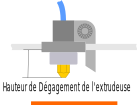

# extruder_clearance_height

* Technologie : FDM
* Groupe : [Réglages de l'Impression](../print_settings/print_settings.md) 
* Sous groupe : [Options de sortie](../print_settings/print_settings.md#options-de-sortie) - [Impression séquentielle](../print_settings/print_settings.md#impression-séquentielle)
* Mode : Expert

## *Dégagement de l'extrudeuse* Hauteur

### Description

Représente la distance verticale entre la pointe de la buse et (habituellement) les tiges du chariot de l'axe X.
En d'autres termes, il s'agit de la hauteur du cylindre de dégagement (de rayon [extruder_clearance_radius](extruder_clearance_radius.md) ) autour de l'extrudeuse,  et elle représente la profondeur maximum à laquelle peut descendre l'extrudeuse avant d'entrer en collision avec d'autres objets imprimés.

[Retour Liste variables](variable_list.md)