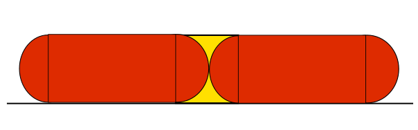

# extrusion_width

* Technologie : FDM
* Groupe : [Réglages de l'Impression](../print_settings/print_settings.md)
* Sous groupe : [Largeur et Débit](../print_settings/print_settings.md#largeur-et-débit) - Largeur d'extrusion
* Mode : Avancé

## Largeur d'extrusion

### Description

Définissez ce paramètre à une valeur non nulle pour définir une largeur d'extrusion manuellement. S'il est laissé à zéro, SuperSlicer  dérive les largeurs d'extrusion à partir du [diamètre de la buse](nozzle_diameter.md) (voir les info bulles pour la largeur d'[extrusion du périmètre](perimeter_extrusion_width.md), la [largeur d'extrusion du remplissage](infill_extrusion_width.md), etc). 

Si elle est exprimée en pourcentage (par exemple : 105%), elle sera calculée sur le [diamètre de la buse](nozzle_diameter.md).

Vous pouvez définir soit ***[Espacement](extrusion_spacing.md)***, soit ***[Largeur](extrusion_width.md)*** ; l'autre sera calculée en utilisant les pourcentages de  [Chevauchement du périmètre](perimeter_overlap.md)  et la [hauteur de couche](layer_height.md) par défaut.

Vous pouvez penser que lorsque la largeur d'extrusion d'un périmètre est de 0,45 mm, deux périmètres auront une largeur de 0,90 mm (2x0,45). Cependant, si vous regardez la recommandation pour une hauteur de couche de 0,2 mm, vous constaterez que ce n'est pas vrai et que la valeur suggérée est de 0,86 mm.

Afin de comprendre comment ce nombre est calculé, nous devons examiner la section transversale d'un cordon. SuperSlicer suppose que la section transversale d'une extrusion est un rectangle avec des extrémités semi-circulaires. Notez que la largeur d'extrusion comprend les deux extrémités semi-circulaires.

*(Cette image est une reprise de la source originale : <https://manual.slic3r.org/advanced/flow-math> )*

Ajoutons maintenant une seconde extrusion/périmètre. Si nous supposons qu'il n'y a pas de chevauchement (chemins tangents), il y aurait un espace vide (en jaune). Afin de remplir l'espace vide et de relier les périmètres ensemble, SuperSlicer chevauche légèrement les périmètres. C'est essentiellement pourquoi vous ne pouvez pas simplement multiplier le nombre de périmètres par la largeur d'un seul périmètre pour obtenir l'épaisseur de paroi idéale.

*(Cette image a été fortement inspirée par la source originale : <https://manual.slic3r.org/advanced/flow-math>)*

> Notez que la hauteur de couche (h) est utilisée dans le calcul et l'implication que cela a - si vous modifiez la hauteur de couche, votre épaisseur de paroi idéale changera également !

Pour plus d'informations, consultez la [page mathématique du Flux de Slic3r](https://manual.slic3r.org/advanced/flow-math) (certaines parties de ce texte proviennent de la même page).

[Retour Liste variables](variable_list.md)