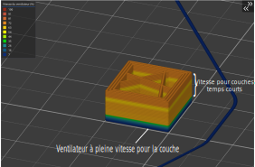

# fan_below_layer_time

* Technologie : FDM
* Groupe : [Réglages du Filament](../filament_settings/filament_settings.md)
* Sous groupe : [Refroidissement](../filament_settings/filament_settings.md#refroidissement) - Temps de couche court 
* Mode : Expert

## Activer le ventilateur si le temps d'impression de la couche inférieur à

### Description

Si le temps d'impression de la couche est estimé inférieur à ce nombre de secondes, le ventilateur sera activé et sa vitesse sera calculée en interpolant les vitesses entre [vitesse par défaut](min_fan_speed.md) (aussi définie comme vitesse minimale) et [vitesse maximale](max_fan_speed.md) .

> Définissez à 0 pour désactiver.

* Valeur par défaut :  60 s

[Retour Liste variables](variable_list.md)