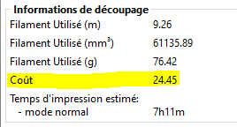

# filament_cost

* Technologie : FDM
* Groupe : [Réglages du Filament](../filament_settings/filament_settings.md)
* Sous groupe : [Filament](../filament_settings/filament_settings.md#filament)
* Mode : Simple

## Coût

### Description

Coût par Kg de votre filament. Cette information est uniquement utilisée pour l'information statistique.
Elle permet d'avoir le côut en plastique de votre impression dans les informations de découpage.

[Retour Liste variables](variable_list.md)
