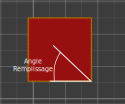

# fill_angle

* Technologie : FDM
* Groupe : [Réglages de l'Impression](../print_settings/print_settings.md)
* Sous groupe : [Remplissage](../print_settings/print_settings.md#remplissage) - Avancé
* Mode : Avancé

## *Angle* Remplissage

### Description

Angle de base par défaut pour l'orientation du remplissage. Des croisements seront appliqués à cette valeur.

Les ponts seront remplis avec la meilleure direction que SuperSlicer peut détecter, ce réglage ne les affecteront donc pas. d'autre part les ponts bénéficient d'un réglage propre pour le [réglage des angles](bridge_angle.md) de remplissage si besoin.

* Valeur par défaut : 45°

[Retour Liste variables](variable_list.md)
