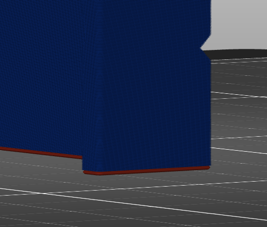
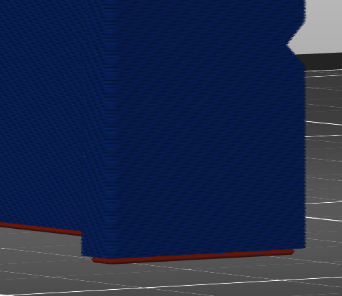

# first_layer_size_compensation

* Technologie : FDM & SLA
* Groupe : [Réglages de l'Impression](../print_settings/print_settings.md)
* Sous groupe : [Couche](../print_settings/print_settings.md#couche) - Modifications des couches
* Mode : Avancé

## *Compensation en XY* Première couche

### Description

Ce réglage n'étend que la couche initiale qui repose sur le plateau d'impression (ou sur le radeau). Comme pour [Compensation en XY extérieur](xy_size_compensation.md) ou [Compensation en XY intérieur](xy_inner_size_compensation.md) , une valeur positive élargira la couche initiale tandis qu'une valeur négative la réduira.

La couche initiale est souvent imprimée sur un plateau chauffée, qui la maintient dans un état légèrement liquide afin d'améliorer l'adhérence au plateau d'impression. La couche initiale est normalement beaucoup plus épaisse que le reste des couches. Cela laisse suffisamment de temps et de matière pour que la couche s'affaisse latéralement, créant un phénomène appelé **pied d'éléphant** où la face inférieure de l'impression a une lèvre légèrement plus large. Ce réglage peut compenser le pied d'éléphant en rendant la couche initiale plus mince. Donnez à ce réglage une petite valeur négative pour compenser la patte de l'éléphant.

[Retour Liste variables](variable_list.md)