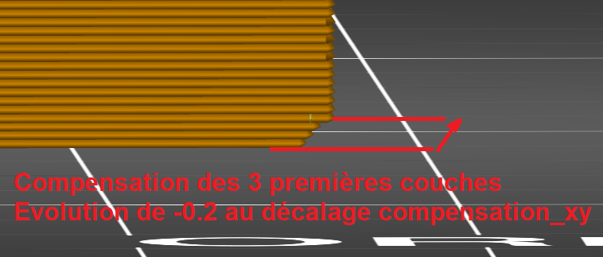

# first_layer_size_compensation_layers

* Technologie : FDM & SLA
* Groupe : [Réglages de l'Impression](../print_settings/print_settings.md)
* Sous groupe : [Couche](../print_settings/print_settings.md#couche) - [Modifications des couches](../print_settings/print_settings.md#modifications-des-couches)
* Mode : Avancé
* Version : 2.3.57.0

## *Compensation en XY de la première couche* Hauteur des couches

### Description

Le nombre de couches sur lesquelles la [compensation des premières couches](first_layer_size_compensation.md) sera active. 

La première couche sera réduite de la valeur de la compensation de la première couche, puis les couches suivantes seront progressivement réduites, jusqu'à la couche indiquée par cette valeur.

[Retour Liste variables](variable_list.md)