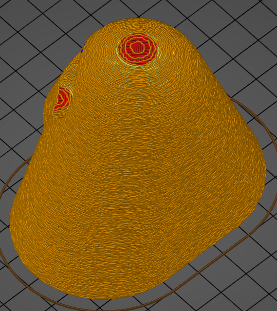

# Fuzzy_skin
* Technologie : FDM
* Groupe : [Réglages de l'Impression](../print_settings/print_settings.md)
* Sous groupe : [Périmètre et enveloppe](../print_settings/print_settings.md#périmètre-et-enveloppe) - [Avancé](../print_settings/print_settings.md#avancé)
* Mode : Simple
* Version : 2.4.X

## Surface irrégulière

### Description

Création sur la peau des impressions d'une surface irrégulière. Lors de l'impression avec une peau floue, la surface des côtés de l'impression est rendue rugueuse. Cela donne à l'impression une sorte de texture.

Possibilité de créer ces surfaces irrégulières soit :
	- Aucun : paramètre désactivé.
	- Murs extérieurs : Appliquer le fuzzy skin uniquement sur les périmètres extérieurs (pas les trous).
	- Tous les périmètres : Appliquer la peau floue sur tous les périmètres (extérieur, intérieur et remplissage des trous).

Ce mode ajoute des ondulation aléatoires à la paroi extérieure pendant l'impression. La surface est ainsi rendue rugueuse au toucher. La surface n'est rendue irrégulière que sur les côtés de l'impression. Aucune irrégularité n'est ajouté sur le dessus.

Ces irrégularités génèrent une perte de la précision dimensionnelle du modèle. La pièce sera certainement plus grande que le modèle original. La ***Surface irrégulière*** rendra également l'impression plus longue, car la tête d'impression est soumise à une forte accélération lors de l'impression de la paroi extérieure.

 

Exemple de surface irrégulière.

[Retour Liste variables](variable_list.md)