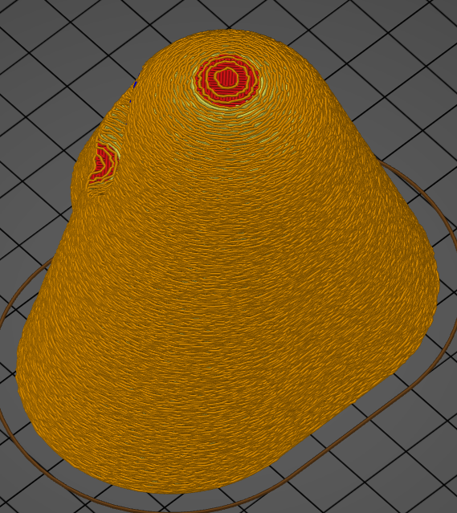

# Fuzzy_skin_thickness
* Technologie : FDM
* Groupe : [Réglages de l'Impression](../print_settings/print_settings.md)
* Sous groupe : [Périmètre et enveloppe](../print_settings/print_settings.md#périmètre-et-enveloppe) - [Avancé](../print_settings/print_settings.md#avancé)
* Mode : Simple
* Version : 2.4.X

## Epaisseur de la surface irrégulière

### Description

Type de peau floue.
	- Aucun : paramètre désactivé.
	- Murs extérieurs : Appliquer le fuzzy skin uniquement sur les périmètres extérieurs (pas les trous).
	- Tous les périmètres : Appliquer la peau floue sur tous les périmètres (extérieur, intérieur et remplissage des trous).

 

 Exemple de peau flou.

[Retour Liste variables](variable_list.md)