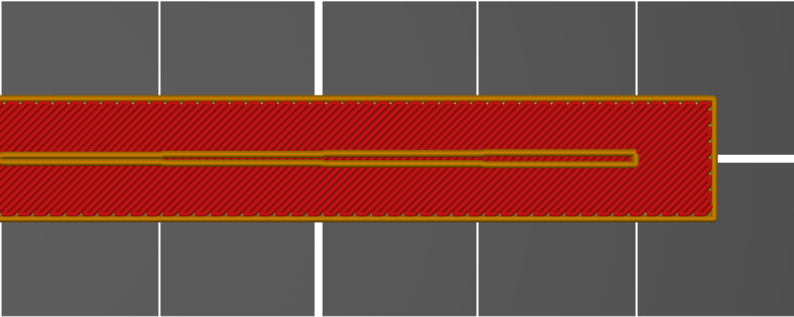

# gap_fill

* Technologie : FDM
* Groupe : [Réglages de l'Impression](../print_settings/print_settings.md)
* Sous groupe : [Périmètre et enveloppe](../print_settings/print_settings.md#périmètre-et-enveloppe) - [Avancé](../print_settings/print_settings.md#avancé)
* Mode : Expert

## Remplir les trous entre les parois

### Description

Activer l'algorithme de remplissage des trous. Il extrudera de petites lignes entre les périmètres lorsqu'il n'y a pas assez d'espace pour un autre périmètre ou un remplissage complet.

[Retour Liste variables](variable_list.md)