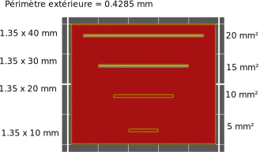

# gap_fill_min_area

* Technologie : FDM
* Groupe : Réglages de l'Impression
* Sous groupe : Périmètre et enveloppe
* Mode : Expert

## *Remplir les trous entre les parois* Surface minimum

### Description

Ce paramètre représente le minimum de mm² pour la création d’une extrusion de remplissage d’espace entre les parois.

> Peut être un % de (largeur du périmètre)²

Sur l'exemple ci dessous on peut voir que pour une largeur de [périmètre extérieure](external_perimeter_extrusion_spacing.md) de 0.4285 la valeur de filtration sur les bossages sera respectivement de 5,10,15 et 20 mm².

Exemple = bossage dimensions extérieures  : 1.35 x 20 mm
(1.35-2x 0.4285) x (20-2x04285) = 9.43 mm²    ->  filtrage à **10 mm²*

Le paramètre est accessible si l'option (Remplir les trous entre les parois) [gap_fill](gap_fill.mp) est active.

[Retour Liste variables](variable_list.md)