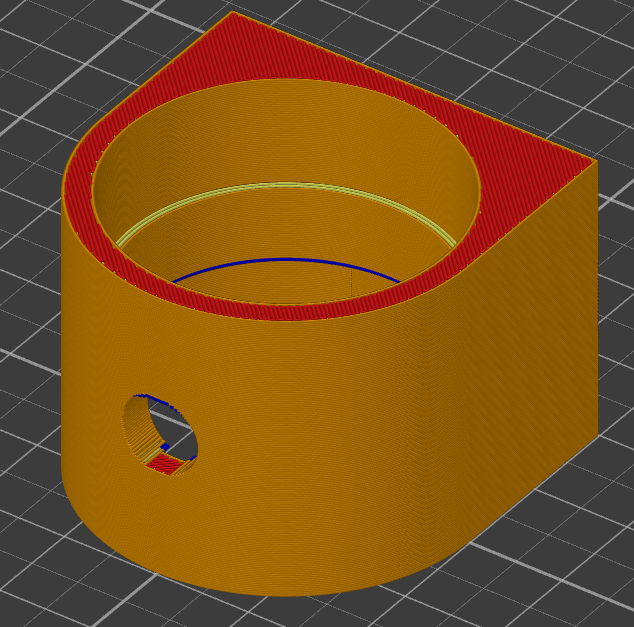
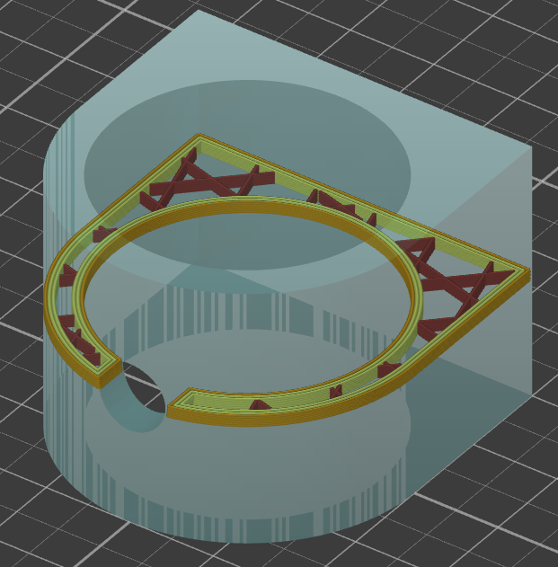

# hole_size_compensation

* Technologie : FDM
* Groupe : [Réglages de l'Impression](../print_settings/print_settings.md)
* Sous groupe : [Couche](../print_settings/print_settings.md#couche) - [Modifications des couches](../print_settings/print_settings.md#modifications-des-couches)
* Mode : Expert

## Compensation du rétrécissement des trous verticaux

### Description

Les trous convexes seront agrandis/rétrécis dans le plan XY par la valeur configurée (négatif = vers l'intérieur, positif = vers l'extérieur, devrait être négatif car les trous sont toujours un peu plus petits à l'intérieur). Cela peut être utile pour ajuster la taille des trous.

Ce paramètre se comporte de la même manière que la [compensation de la taille XY interne](xy_inner_size_compensation.md), mais uniquement pour les **formes convexes**. Il s'ajoute à [xy_inner_size_compensation](xy_inner_size_compensation.md), il ne le remplace pas. 

La compensation s'applique pour les trous dont la dimension est inférieure au [Seuil](hole_size_threshold.md).

Attention aux géométries comportant des intersections avec trous horizontaux. Au niveau de ces intersections la section passe contour extérieure est la correction ne s'applique plus.

[Retour Liste variables](variable_list.md)