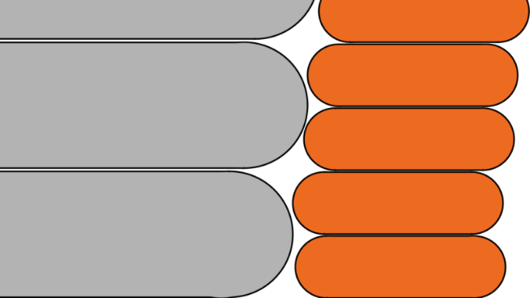

# infill_every_layers

* Technologie : FDM
* Groupe : [Réglages de l'Impression](../print_settings/print_settings.md)
* Sous groupe : [Remplissage](../print_settings/print_settings.md#remplissage) - Réduction du temps d'impression
* Mode : Avancé

## Combiner le remplissage toutes les X couches

### Description

Cette fonction permet de combiner le remplissage afin d'accélérer l'impression en extrudant des couches de remplissage plus épaisses tout en conservant des périmètres fins, pour plus de précision.

Différentes hauteurs de couche seront utilisées pour le remplissage et pour les périmètres afin d'accélérer l'impression sans sacrifier sa qualité.

**Exemple :** Combiner un remplissage toutes les 3 couches, avec une hauteur de couche de 0,1 mm, le remplissage étant imprimé avec une hauteur de couche de 0,3 mm.

La hauteur de couche maximum est limitée par le diamètre de votre buse. Si vous essayez de combiner un remplissage toutes les 1+ couches avec une buse de 0,4 mm et une hauteur de couche de 0,3 mm, aucun changement ne va réellement se produire car vous ne pouvez pas imprimer des couches plus grandes que (environ) 0,32 mm (80% du diamètre de la buse).

Remplissage (en gris) imprimé avec une hauteur de couche deux fois supérieure à celle des périmètres (en orange)

[Retour Liste variables](variable_list.md)