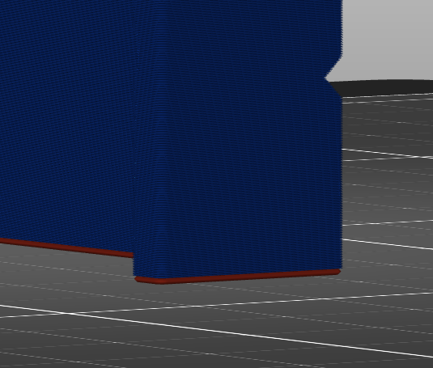

# initial_layer_height

* Technologie : FDM & SLA
* Groupe : [Réglages de l'Impression](../print_settings/print_settings.md)
* Sous groupe : Hauteur de couche
* Mode : Simple

## Hauteur de la première couche

### Description

Ce paramètre définit l'épaisseur de la première couche de votre impression. La couche initiale est normalement imprimée plus épaisse que le reste afin de créer une adhérence plus forte avec le plateau d'impression. Avec ce réglage, l'épaisseur de la couche initiale peut être augmentée sans réduire la résolution du reste de l'impression.

L'augmentation de l'épaisseur de la couche initiale fait que la buse extrude plus de matière sur la même distance. Cela demande une force supplémentaire, car le matériau s'étale sur les côtés pour remplir toute la largeur de la ligne. Cette force supplémentaire fait que le matériau adhère mieux au plateau d'impression. De plus, la couche plus épaisse permet de rattraper les irrégularités de la planéité de la surface. Si le plateau d'impression est légèrement tordu, la variabilité sera absorbée par l'épaisseur de la première couche, alors qu'autrement la buse pourrait le racler dans la deuxième couche.

Une épaisseur trop importante de la première couche entraîne un affaissement plus important de la première couche, ce qui provoque des pattes d'éléphant. Le paramètre [Compensation XY de la première couche](first_layer_size_compensation.md) peut empêcher cela en lui donnant une petite valeur négative.

[Retour Liste variables](variable_list.md)