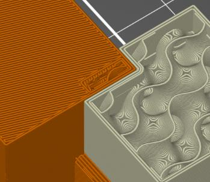

# interface_shells

* Technologie : FDM
* Groupe : Réglages de l'Impression
* Sous groupe : Extrudeuse multiples - Avancé
* Mode : Expert

## Création d'interface entre coques

### Description

Force la génération de coques pleines entre des volumes/matériaux adjacents. Utile pour des impressions multi-extrudeurs avec des matériaux translucides ou avec un support manuel soluble.

 

A gauche l’option n’est pas activée / A droite option coque d’interface activée.

[Retour Liste variables](variable_list.md)