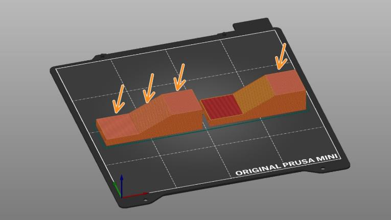

# ironing_type

* Technologie : FDM
* Groupe : [Réglages de l'Impression](../print_settings/print_settings.md)
* Sous groupe : [Remplissage](../print_settings/print_settings.md#remplissage) - Lissage en Post-traitement
* Mode : Avancé

## Permettre le lissage en post-traitement sur 

Définition du type de lissage. Permet d'indiquer où sera appliqué l'opération de lissage.

### *Toutes les surfaces de dessus*

La buse lissera la couche supérieure de chaque surface (la dernière couche de chaque zone plane).

### *Surface supérieure uniquement*

Seule la toute dernière couche de l'objet sera lissée. Cela signifie que dans le cas d'un texte en relief (orienté parallèlement au lit d'impression), seule la partie supérieure des lettres sera repassée, mais pas l'espace entre les lettres.

### ***Toutes les surfaces pleines***

Cette option ne fonctionne pas correctement pour le moment.

Chaque couche recevra une passe de lissage. Une fonction expérimentale destinée à être utilisée avec un remplissage à 100% pour créer des objets plus transparents.

Paramètre actif si [ironing](ironing.md) est actif.

[Retour Liste variables](variable_list.md)