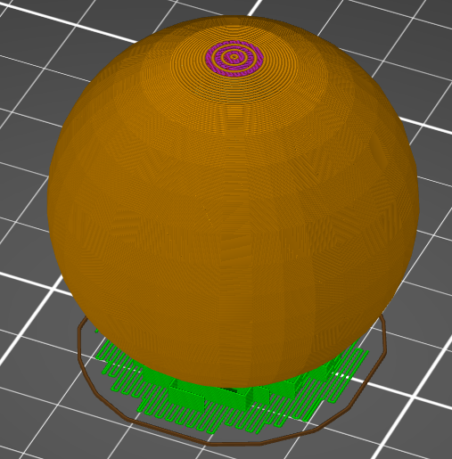
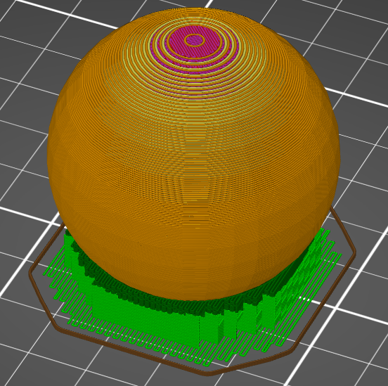

# layer_height

* Technologie : FDM & SLA
* Groupe : Réglages de l'Impression
* Sous groupe : Hauteur de couche
* Mode : Avancé

## Hauteur de base des couches

### Description
L'imprimante 3D dépose le plastique par couches. La hauteur des couches est l'épaisseur de ces couches en millimètres. C'est le facteur le plus important tant pour la qualité visuelle de votre impression finale que pour le temps d'impression.

 

La hauteur de la couche est le paramètre le plus important pour affecter la qualité globale et, inversement, le temps d'impression  :
* Le fait d'avoir des couches plus fines augmente la qualité visuelle de l'impression. Comme les couches sont plus fines, l'effet de marche d'escalier  sera réduit. De plus, les couches seront plus proches les unes des autres et les espaces entre les couches seront donc plus petits, ce qui donnera une finition plus lisse dans l'ensemble.
* Le fait d'avoir des couches plus fines permet à l'imprimante de produire plus de détails sur les côtés supérieur et inférieur de votre impression.
* Le fait d'avoir des couches plus épaisses tend à rendre l'impression plus résistante, jusqu'à un certain point. . Les couches plus épaisses se cisailleront moins facilement.
* Les couches plus épaisses réduisent le temps d'impression.

### Hauteur des couches par rapport aux profils

De nombreux paramètres dépendent de la hauteur de la couche. Comme la hauteur de la couche affecte considérablement le débit du matériau à travers la buse, de nombreux paramètres du processus d'impression vont changer. Ceci est très complexe. Par exemple, lorsque vous augmentez la hauteur de la couche, vous devrez probablement augmenter légèrement la température d'impression pour compenser le taux supplémentaire de perte de chaleur. La température affecte alors la fluidité du matériau, ce qui aura une incidence sur la netteté de vos coins et sur le refroidissement nécessaire, etc. 

### Notes supplémentaires

A très faible hauteur de couche, vous pourriez atteindre la limite de résolution de votre axe Z. Vérifiez la taille du pas de l'axe Z de votre imprimante et assurez-vous que la hauteur de la couche est un multiple de celle-ci. Si elles ne correspondent pas, certaines couches seront plus épaisses que d'autres, ce qui entraînera des défauts visuels sur les impressions sous forme de bandes.

*Notez que le réglage de la [hauteur de base des couches](initial_layer_height.md) ne s'applique pas à la couche initiale de l'impression qui ont a son propre réglage pour ajuster la hauteur des couches séparément.*

[Retour Liste variables](variable_list.md)