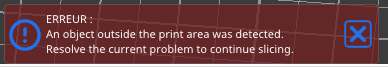

# max_print_height

* Technologie : FDM
* Groupe : [Réglages de l'Imprimante](../printer_settings/printer_settings.md)
* Sous groupe : [Général](../printer_settings/printer_settings.md#général) -  [Taille et coordonnées](../printer_settings/printer_settings.md#taille-et-coordonnées)
* Mode : Avancé

## Hauteur maximale d'impression

### Description

Réglez cette valeur sur la hauteur maximum que peut atteindre votre extrudeuse au cours de l'impression.

* Valeur par défaut : 200 mm

Si la hauteur d'impression dépasse cette limite SuperSlicer affichera un message d'erreur et ne calculera pas le G-Code

La variable peut être utilisé aussi dans les macros de réglage des dégagements comme par exemple dans le G-Code de fin:

 {if max_layer_z +32 < max_print_height}G1 Z30{else]G1 Z{max_print_height - max_layer_z -2}{endif}

 
[Retour Liste variables](variable_list.md)
