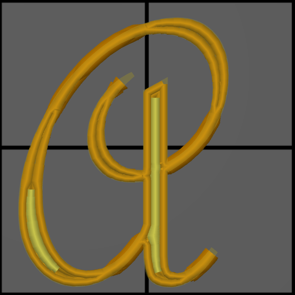

# min_bead_width

* Technologie : FDM
* Groupe : [Réglages de l'Impression](../print_settings/print_settings.md)
* Sous groupe : [Périmètre et enveloppe](../print_settings/print_settings.md#périmètre-et-enveloppe)  - Paramètres Arachne 
* Mode : Expert

## Forme minimale  Largeur minimale du contour

### Description

Largeur du périmètre qui remplacera les caractéristiques fines (selon la [Taille minimale des entités](min_feature_size.md)) du modèle. Si la largeur minimale du périmètre est plus fine que l'épaisseur de l'élément, le périmètre deviendra aussi épais que l'élément lui-même. 

Ce paramètre permet d'imprimer de très petits détails avec une largeur de ligne qui est en fait trop grande pour eux. Au lieu d'imprimer des lignes très fines, il imprime avec une largeur de ligne plus raisonnable.

Si la [Taille minimale des entités](min_feature_size.md) est très faible, des pièces très fines peuvent être imprimées. Cela ne fonctionne pas bien. Il est possible d'imprimer des lignes plus petites que la taille de la buse, mais pas de beaucoup. L'impression de lignes trop fines entraîne une extrusion incohérente.

Au lieu de cela, ces lignes très fines sont rendues plus larges afin qu'elles soient extrudées de manière plus cohérente. Toute partie du modèle qui est plus fine que la largeur minimale de la ligne de paroi mince sera imprimée en utilisant une seule ligne de la largeur minimale de la ligne de paroi mince. Les lignes deviennent alors plus larges que la largeur originale du modèle. Cela réduit la précision dimensionnelle, mais au moins l'impression sera fiable.

La valeur de ce paramètre doit correspondre à la largeur de ligne la plus fine que l'imprimante peut atteindre de manière fiable avant de commencer à créer  une extrusion incohérente. Cette valeur se situe normalement entre la taille de la buse et la moitié de la taille de la buse. L'augmenter conduit à l'impression de pièces fines trop grosses, mais réduit les risques de sous-extrusion dus à l'impression de lignes trop fines.

Si elle est exprimée en pourcentage (par exemple 85%), elle sera calculée sur le diamètre de la buse.

[Retour Liste variables](variable_list.md)