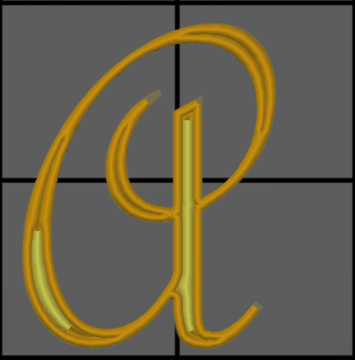
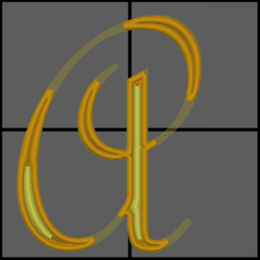

# min_feature_size

* Technologie : FDM
* Groupe : [Réglages de l'Impression](../print_settings/print_settings.md)
* Sous groupe : [Périmètre et enveloppe](../print_settings/print_settings.md#périmètre-et-enveloppe)  - Paramètres Arachne 
* Mode : Expert

## Forme minimale  Taille minimale de l'élément

### Description

Épaisseur minimale des éléments minces. Les formes du modèle qui sont plus fines que cette valeur ne seront pas imprimées, tandis que les formes plus épaisses que la taille minimale de l'élément seront élargie à la largeur minimale du contour.

Ce paramètre contrôle la largeur minimale des détails du modèle qui seront imprimés. Tout ce qui est plus fin que cela ne sera pas imprimé.

Les détails qui sont plus petits que la taille de la buse ne sont pas susceptibles d'être imprimés correctement. Il s'agit d'une limitation de l'imprimante. Cependant, SuperSlicer peut toujours tenter de les imprimer, en acceptant  que les détails finissent par être plus épais que ceux modélisés.

Réduire la taille minimale de l'élément permet à l'imprimante d'imprimer des détails plus petits de l'impression. Ces petits détails peuvent être imprimés en extrudant très peu (ce qui provoque une sous-extrusion, ou en extrudant des largeurs de ligne plus raisonnables mais en les imprimant surdimensionnées. 

En mettant cette valeur à 0, l'imprimante va jusqu'au bout de chaque angle vif.

En augmentant la taille minimale des entités, l'imprimante ne se préoccupe pas des petits détails qui, de toute façon, ne seraient pas bien rendus. Cela permet de gagner un peu de temps et de rendre l'impression plus propre.

[Retour Liste variables](variable_list.md)
