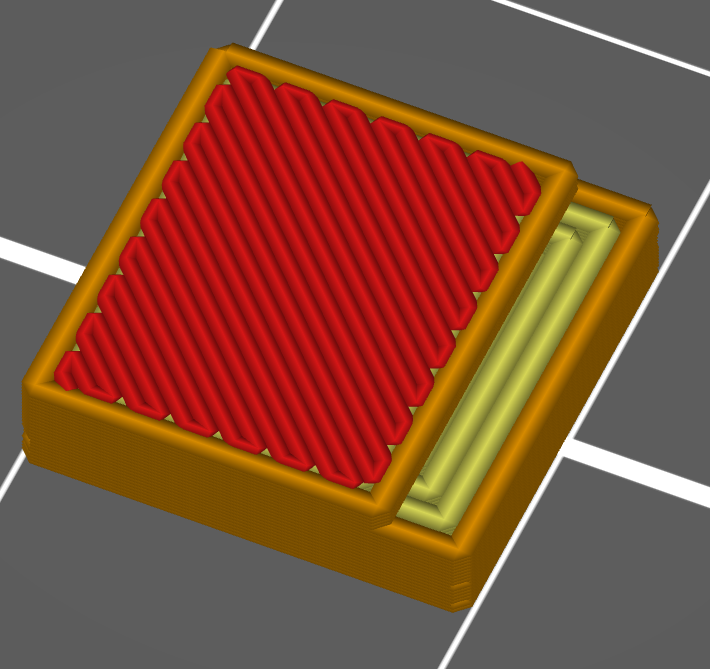
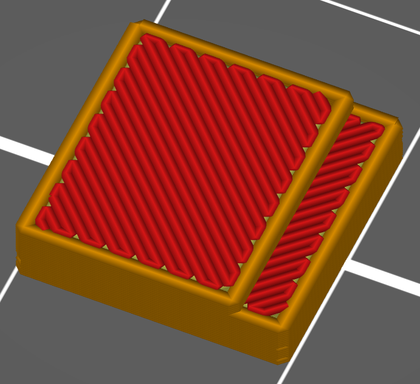

# min_width_top_surface

* Technologie : FDM
* Groupe : Réglages de l'Impression
* Sous groupe : Périmètre et enveloppe
* Mode : Expert

## Largeur minimale

### Description

Si une surface du dessus doit être imprimée et qu'elle est partiellement couverte par une autre couche, elle ne sera pas considérée comme une couche du dessus dont la largeur est inférieure à cette valeur. 

Cela peut être utile pour ne pas laisser l'option ***[un périmètre sur le dessus](only_one_perimeter_top.md)*** se déclencher sur surface qui ne devrait être couverte que par des périmètres. Cette valeur peut être un mm ou un % de la [largeur d'extrusion du périmètre](perimeter_extrusion_width.md).

Sans l'influence su paramètre Largeur minimale

* Valeur par défaut : 200%

[Retour Liste variables](variable_list.md)