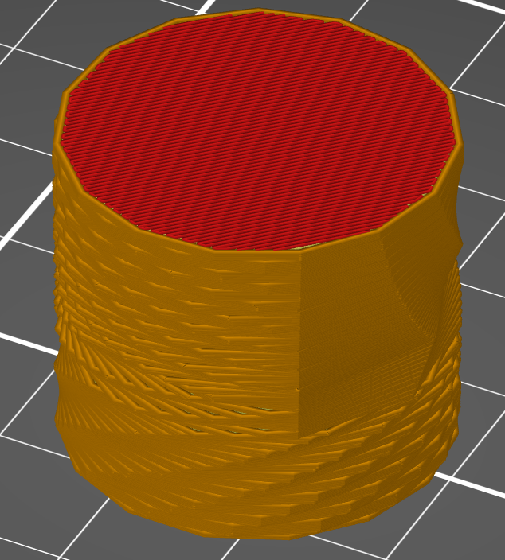
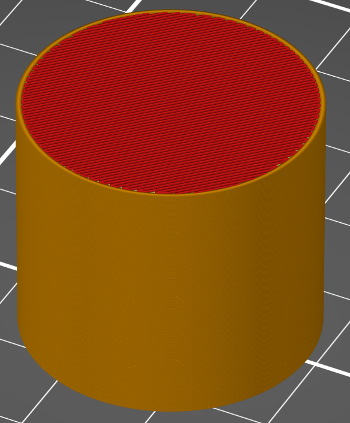

# model_precision

* Technologie : FDM
* Groupe : [Réglages de l'Impression](../print_settings/print_settings.md)
* Sous groupe : [Couche](../print_settings/print_settings.md#couche) - [Filtration](../print_settings/print_settings.md#filtration)
* Mode : Avancé

## Précision de la lecture du modèle

### Description

Ce paramètre représente la précision du fichier de l'objet en entrée.  Il est utilisé pour aligner des points qui devraient être sur la même ligne.

> Utiliser la valeur  0 pour désactiver le paramètre

Exemple ci dessous avec un réglage à 0.05 mm ( rappel par défaut valeur fixée à  0.0001 mm).

* Valeur par défaut : 0.0001 mm.

[Retour Liste variables](variable_list.md)