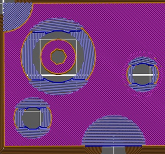

# no_perimeter_unsupported_algo

* Technologie : FDM
* Groupe : [Réglages de l'Impression](../print_settings/print_settings.md)
* Sous groupe : [Périmètre et enveloppe](../print_settings/print_settings.md#périmètre-et-enveloppe) - [Avancé](../print_settings/print_settings.md#avancé)
* Mode : Avancé

## Pas de périmètres dans un pont

### Description

Cette option est là pour aider à découper les objets qui ont un trou de contre-perçage. 

L'option encore expérimentale est utilisée pour supprimer les périmètres où il n'y a rien en dessous et où un remplissage ponté devrait être meilleur. 
- Retirer les périmètres : supprimez les périmètres non soutenus, laissez la zone de pont en l'état.
- Ne garder que les ponts : supprimez les périmètres dans les zones de pont, ne gardez que les ponts qui se terminent dans une zone pleine.
- Conserver les ponts et les surplombs : supprimez les périmètres non soutenus, ne conservez que les ponts qui se terminent dans une zone pleine, remplissez le reste avec des périmètres de surplomb+ponts.
- Remplir les vides avec des ponts : supprimez les périmètres non soutenus, créer des ponts sur l'ensemble du trou.* !! Celui-ci peut entraîner des problèmes avec des surplombs en forme de /\, donc vous devriez l'utiliser seulement sur une couche à la fois via le modificateur de hauteur!
 
**!! l'utilisation de la fonction est intensive en termes de calcul !!**

Il existe plusieurs options pour résoudre ce problème :

- **Retirer les périmètres** : il suffit de déplacer le périmètre depuis la zone du pont.

> Pour (+) : simple et efficace.
> Contre (-) : certains ponts ne sont pas ancrés des deux côtés.

- **Remplir les vides avec des ponts** : déplacez le périmètre et étendez la zone du pont pour remplir l'espace vide. Cela créera un opercule que l'utilisateur devra retirer manuellement. Notez que vous pouvez faire cela manuellement en créant un nouveau cylindre à cette position (clic droit sur votre pièce -> ajouter une pièce -> cylindre, dans la zone de droite déverrouiller les échelles et changer la taille X&Y ; appuyer sur entrée et ensuite le déplacer dans votre trou ; changer sa taille z à votre hauteur de couche et entrer la position Z).

> Pour (+) : meilleur effet de contre-perçage.
> Contre (-) : les cônes de contre-perçage avec un angle raide détruiront votre pièce à cause de la surextrusion (encore plus que la normale).

- **Ne gardez que les ponts** : n'imprimez aucune zone qui ne soit pas un pont. Trop expérimental, ne l'utilisez pas avant qu'il ne s'améliore un peu. 

> Pour  (+) : ? simple ?
> Contre (-) : détruira vos surplombs et je ne pense pas qu'il imprimera mieux le trou de contre-alésage non plus.

- **Conserver les ponts et les surplombs** : Il imprime le pont comme l'option précédente, mais remplit le reste avec un périmètre et des "mauvais ponts". Très expérimental. 

> Pour (+) : va pousser la bonne quantité de plastique, comme "Supprimer les périmètres" mais avec moins de "ponts ancrés sur un côté".
> Contre (-) : difficile à imprimer.

[Retour Liste variables](variable_list.md)