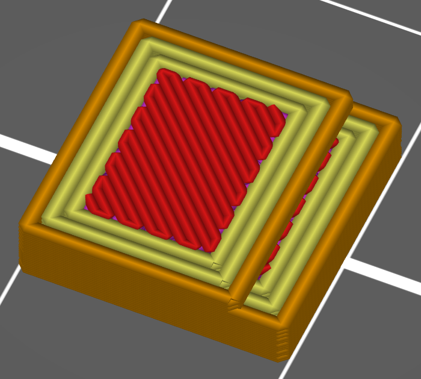
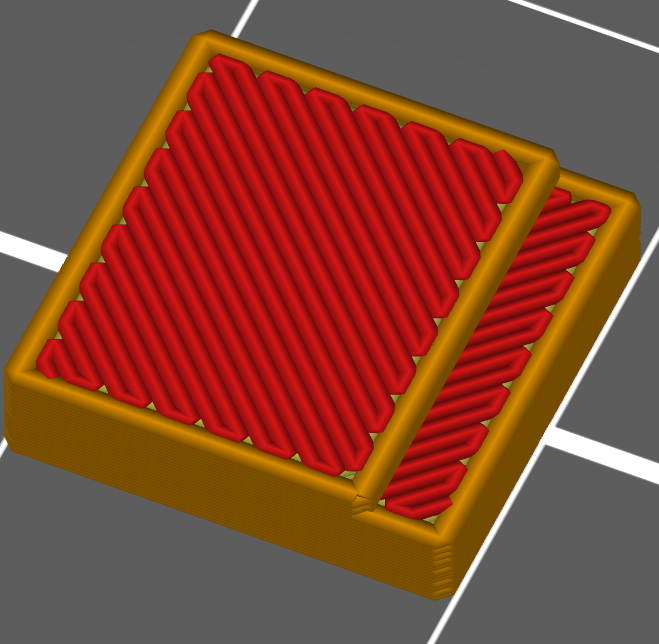

# only_one_perimeter_top

* Technologie : FDM
* Groupe : [Réglages de l'Impression](../print_settings/print_settings.md)
* Sous groupe : [Périmètre et enveloppe](../print_settings/print_settings.md#périmètre-et-enveloppe)
* Mode : Simple

## Un seul périmètre sur le dessus

### Description

N'utiliser qu'un seul périmètre sur les surfaces plates du dessus,  pour laisser plus de place au motif de dessus.
Exemple d'une pièce en mode normale avec 3 périmètres.

Avec le paramètre **Un seul périmètre sur le dessus**  activé.

[Retour Liste variables](variable_list.md)