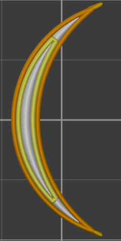
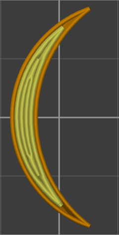

# perimeter_generator

* Technologie : FDM
* Groupe : [Réglages de l'Impression](../print_settings/print_settings.md)
* Sous groupe : [Périmètre et enveloppe](../print_settings/print_settings.md#périmètre-et-enveloppe)  - Paramètres Arachne 
* Mode : Avancé

## Générateur de Périmètres

### Description

Cette option définit le mode de génération des paramètres.
 
Option : 
	
	- Classique : Le générateur de périmètre classique produit des périmètres avec une extrusion constante et pour les zones très fines, on utilise du remplissage de vide.

    
	- Arachne :  Le moteur Arachne produit des périmètres avec une largeur d'extrusion variable.

[Retour Liste variables](variable_list.md)