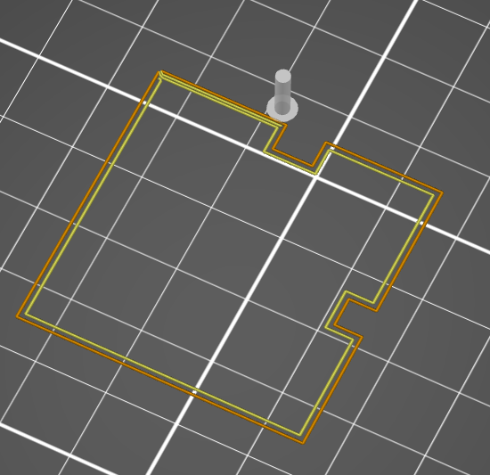

# perimeter_loop

* Technologie : FDM
* Groupe : [Réglages de l'Impression](../print_settings/print_settings.md)
* Sous groupe : [Périmètre et enveloppe](../print_settings/print_settings.md#périmètre-et-enveloppe) - [Avancé](../print_settings/print_settings.md#avancé)
* Mode : Avancé

## Périmètre à une boucle

### Description

Enchaînez les périmètres pour créer une seule extrusion continue sans interruption.
Les longs déplacements intérieurs (de l'extérieur aux trous) ne sont pas extrudés pour laisser un peu d'espace au remplissage.

Cette option permet d’enchaîner les périmètres pour créer une seule extrusion continue sans interruption. Les longs déplacements intérieurs (de l'extérieur aux trous) ne sont pas extrudés pour laisser un peu d'espace au remplissage.

L’option ***[Jointures](perimeter_loop_seam.md)*** Permet de spécifier la position des points de départ des jonctions entre périmètres. Il est possible de choisir entre :

- ***Au plus près*** : Au plus près entre les jointures ou sur l’arrière.
- Et ***Arrière*** : à l’arrière du modèle.

[Retour Liste variables](variable_list.md)