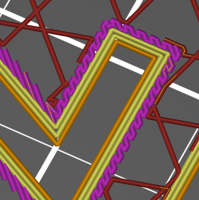
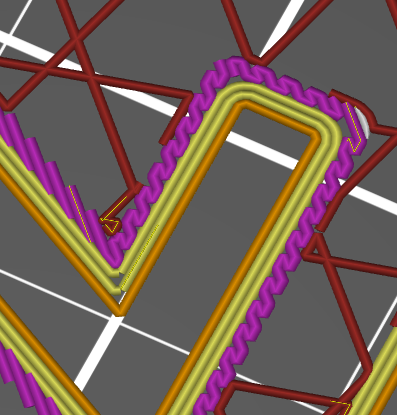

# perimeter_round_corners

* Technologie : FDM
* Groupe : [Réglages de l'Impression](../print_settings/print_settings.md)
* Sous groupe : [Périmètre et enveloppe](../print_settings/print_settings.md#périmètre-et-enveloppe) - [Avancé](../print_settings/print_settings.md#avancé)
* Mode : Avancé

## Coins arrondis

### Description

Avec cette option, les périmètres internes contourneront les angles aigus en créant un rayon au lieu de faire un angle aigu. Cela peut aider quand il y a des trous visibles dans les coins aigus des périmètres.

 

 Exemple de périmètres à droite obtenus avec l’option **Coins arrondis**

[Retour Liste variables](variable_list.md)