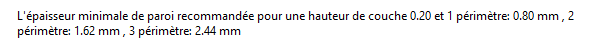
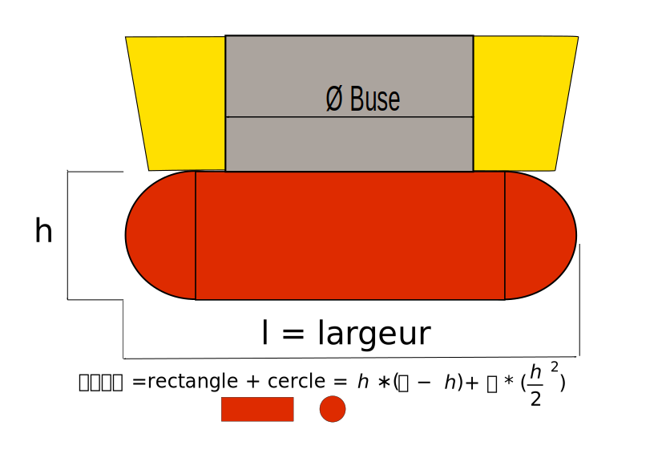
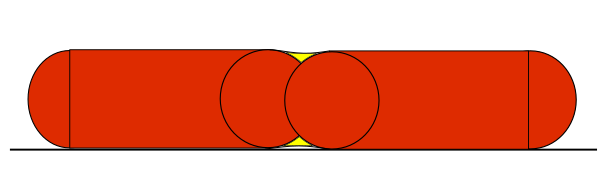

# perimeters

* Technologie : FDM
* Groupe : [Réglages de l'Impression](../print_settings/print_settings.md)
* Sous groupe : [Périmètre et enveloppe](../print_settings/print_settings.md#périmètre-et-enveloppe)  - Parois verticales
* Mode : Simple

## Périmètres

### Description

Cette option définit le nombre de périmètres à générer pour chaque couche.

Pour un nombre sélectionné de périmètres et une hauteur de couche, SuperSlicer calcule l'**épaisseur des parois fines optimale**. Si vous revenez à votre dessin CAO et modifiez l'épaisseur de la paroi à cette valeur exacte, vous éliminerez les chevauchements inutiles du périmètre et votre impression aura une finition parfaite de la surface des parois.

Vous pouvez penser que lorsque la largeur d'extrusion d'un périmètre est de 0,45 mm, deux périmètres auront une largeur de 0,90 mm (2x0,45). Cependant, si vous regardez la recommandation pour une hauteur de couche de 0,2 mm, vous constaterez que ce n'est pas vrai et que la valeur suggérée est de 0,86 mm.

Afin de comprendre comment ce nombre est calculé, nous devons examiner la section transversale d'un cordon. SuperSlicer suppose que la section transversale d'une extrusion est un rectangle avec des extrémités semi-circulaires. Notez que la largeur d'extrusion comprend les deux extrémités semi-circulaires.

*(Cette image est une reprise de la source originale : <https://manual.slic3r.org/advanced/flow-math> )*

Ajoutons maintenant une seconde extrusion/périmètre. Si nous supposons qu'il n'y a pas de chevauchement (chemins tangents), il y aurait un espace vide (en jaune). Afin de remplir l'espace vide et de relier les périmètres ensemble, SuperSlicer chevauche légèrement les périmètres. C'est essentiellement pourquoi vous ne pouvez pas simplement multiplier le nombre de périmètres par la largeur d'un seul périmètre pour obtenir l'épaisseur de paroi idéale.

*(Cette image a été fortement inspirée par la source originale : <https://manual.slic3r.org/advanced/flow-math>)*

> Notez que la hauteur de couche (h) est utilisée dans le calcul et l'implication que cela a - si vous modifiez la hauteur de couche, votre épaisseur de paroi idéale changera également !

Pour plus d'informations, consultez la [page mathématique du Flux de Slic3r](https://manual.slic3r.org/advanced/flow-math) (certaines parties de ce texte proviennent de la même page).

Notez que SuperSlicer peut augmenter cette valeur automatiquement s'il détecte une surface inclinée qui nécessite un plus grand nombre de périmètres,  si l'option **[Périmètres supplémentaires sur les surplombs](extra_perimeters_overhangs.md)** est sélectionnée.

[Retour Liste variables](variable_list.md)