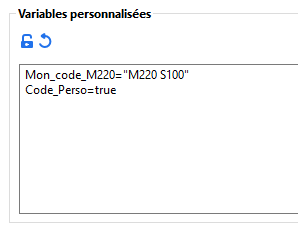
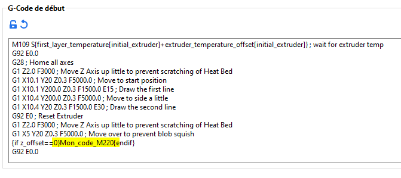

# print_custom_variables

* Technologie : FDM
* Groupe : [Réglages de l'Impression](../print_settings/print_settings.md)
* Sous groupe : Variables personnalisées
* Mode : Avancé
* Version : 2.3.57.5

## Variables personnalisées

### Description

Vous pouvez ajouter des variables personnalisées accessibles dans les G-Code personnalisés.

Chaque ligne peut définir une variable.

Le format est "nom_variable=valeur". Le nom de la variable ne doit comporter que des caractères [a-zA-Z] ou "_".

Une valeur qui peut être analysée comme un entier (int) ou un réel (float) sera disponible comme une valeur numérique.

Une valeur qui est encadrée de guillemets doubles sera disponible sous forme de chaîne de caractères (sans les guillemets)

Une valeur qui ne prend que les valeurs 'true' ou 'false' sera un booléen (boolean).

Toute autre valeur sera analysée comme une chaîne de caractères telle quelle.

Exemple d'utilisation :

Déclaration des variables :

Utilisation de la variable dans les G-Code personnalisés :

[Retour Liste variables](variable_list.md)
