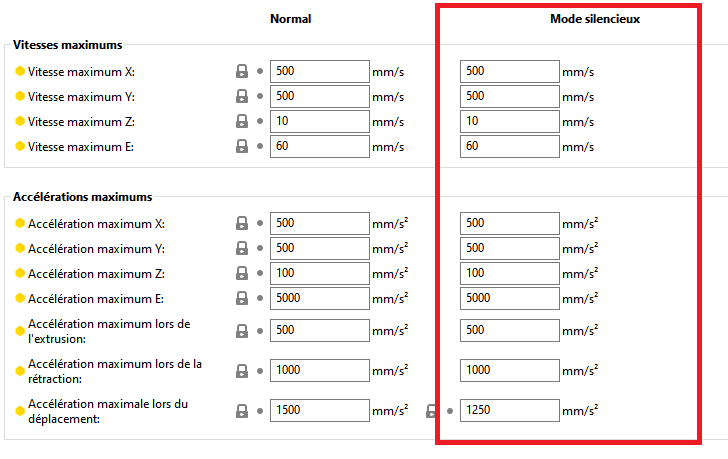

# silent_mode

* Technologie : FDM
* Groupe : [Réglages de l'Imprimante](../printer_settings/printer_settings.md)
* Sous groupe : [Général](../printer_settings/printer_settings.md#général) - [Firmware](../printer_settings/printer_settings.md#firmware)
* Mode : Avancé

## Supporte le mode silencieux

### Description

Indique que le firmware est compatible avec le mode silencieux. 

Ce mode permet normalement aux imprimantes d'être un peu plus silencieuses en fonctionnement. Le mode silencieux ne se déplace pas nécessairement plus lentement.  Lorsque l'imprimante est mise en mode silencieux, elle utilise les paramètres d'accélération et de vitesse de la section silencieux du firmware (qui correspondent à ceux de la section ***Mode silencieux*** de la configuration de l'imprimante). Ainsi, elle n'atteindra pas les mêmes vitesses puisque l'accélération est plus faible et que le firmware limite les vitesses maximums.  

Le mode silencieux fait aussi des choses avec les courants d'entraînement ce qui, je pense, explique pourquoi la détection de collision ne fonctionne pas dans ce mode sur les imprimantes Prusa.

Si vous voulez qu'il soit plus silencieux pendant la nuit, en plus de passer en mode furtif, vous pouvez également réduire la vitesse en utilisant la commande de l'imprimante. Cela peut être fait dans n'importe quel mode et fait partie de son fonctionnement normal.  Il suffit de la ramener à un niveau suffisamment bas pour vous et, le matin, si l'impression se poursuit, de la ramener à 100 %.

[Retour Liste variables](variable_list.md)