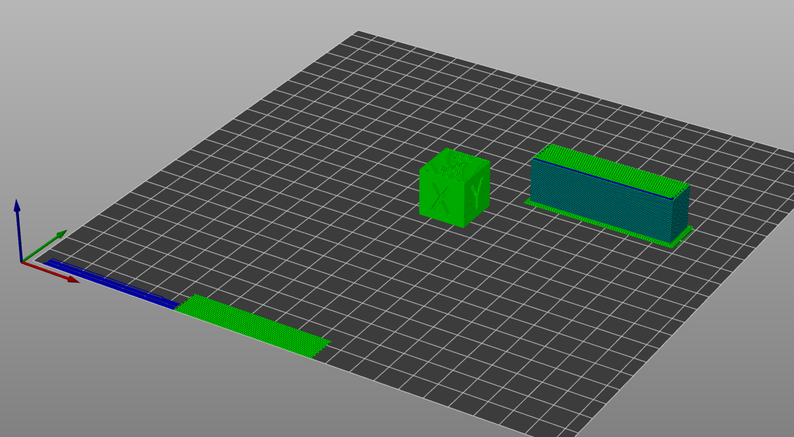

# single_extruder_multi_material_priming

* Technologie : FDM
* Groupe : [Réglages de l'Impression](../print_settings/print_settings.md)
* Sous groupe : [Extrudeuse](../printer_settings/printer_settings.md#extrudeuse)s multiples - Tour de purge
* Mode : Avancé

## Préparer toutes les extrudeuses d'impression

### Description

Si l'option est activé, toutes les extrudeuses qui impriment seront positionnés sur la jupe avant du plateau d'impression au début de l'impression et une bande de test sera extrudé pour chacune.

[Retour Liste variables](variable_list.md)