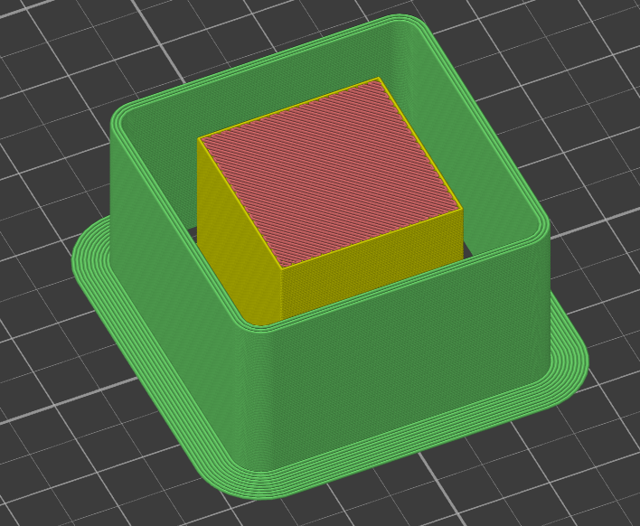

# skirt_brim

* Technologie : FDM
* Groupe : [Réglages de l'Impression](../print_settings/print_settings.md)
* Sous groupe : [Jupe et Bordure](../print_settings/print_settings.md#jupe-et-bordure) - [Jupe](../print_settings/print_settings.md#jupe)
* Mode : Expert

## Bordure

### Description

Lignes de bordure supplémentaire qui sera rajouté à la jupe. Utile par exemple si la jupe est utilisé en bouclier contre les flux d'air afin d'assurer l'adhérence du bouclier sur le plateau d'impression.

[Retour Liste variables](variable_list.md)